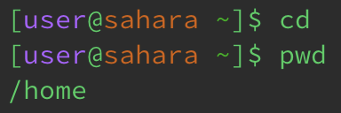
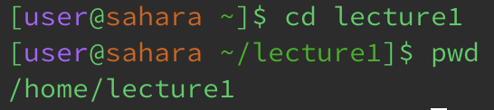
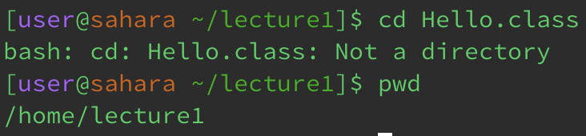

# Lab Report 1
## cd 
1. no argument:
   * 
   * the working directory is /home
   * the directory was set to /home after running the code
     No argument means resetting whatever the working directory is to /home
   * the output is not an error
     
2. to a directory:
   * 
   * the working directory is /lecture1 
   * the directory was changed to /lecture1 under /home 
   * the output is not an error
     
3. to a file:
   * 
   * the working directory is still /lecture1, the directory containing the file I attempted to open
   * i got the output because a file is not a directory
   * the output is an error because a file is not a directory 

## ls 
1. no argument:
   * 
   * the working directory is /lecture1
   * i got the output because by running ls with no arguments, it returns all the files and folders in the current directory
   * the output is not an error
     
2. to a directory:
   * 
   * the working directory is /lecture1
   * i got the output because by running ls with a path to a directory, it returns all the files and folders in that specific directory; however, the directory wasn't changed
   * the output is not an error
     
3. to a file:
   * 

## cat 
1. no argument:
   * 
2. to a directory:
   * 
3. to a file:
   * 
