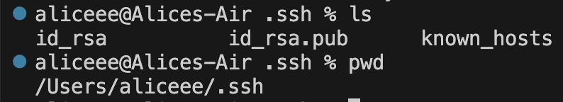
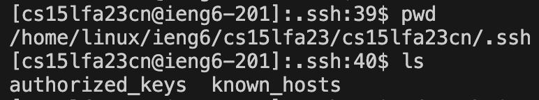
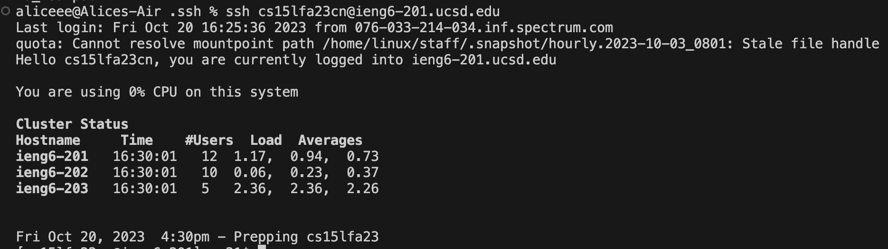

# Lab Report 2

## Part 1

- Image: Code

- Image: Hello

- Which methods in your code are called?
  The String handleRequest(URI url) method was called.
  
- What are the relevant arguments to those methods, and the values of any relevant fields of the class?
  The argument to the method is **http://localhost:4000**. The value of str is **Hello**, and the value of num is **1**.
  
- How do the values of any relevant fields of the class change from this specific request? If no values got changed, explain why.
  The value of num changed from **0** to **1**.
  The value of str changed from an empty string to **1. Hello** /n.  

- Image: How are you

- Which methods in your code are called?
  The String handleRequest(URI url) method was called.
  
- What are the relevant arguments to those methods, and the values of any relevant fields of the class?
  The argument to the method is **http://localhost:4000**. The value of str is **How are you**, and the value of num is **2**.
  
- How do the values of any relevant fields of the class change from this specific request? If no values got changed, explain why.
  The value of num changed from **1** to **2**.
  The value of str changed from **1. Hello** to **1. Hello** /n **2. How are you ** /n

## Part 2
- The path to the private key for your SSH key for logging into ieng6 (on your computer or on the home directory of the lab computer)
  
- The path to the public key for your SSH key for logging into ieng6 (within your account on ieng6)
  
- A terminal interaction where you log into ieng6 with your course-specific account without being asked for a password.
  
  
## Part 3
- Pretty much everything we learned in labs in week 2 and 3 is new to me. I learned how to log in to a connect to a server from a remote computer, and how to build and create a server by implementing URLHandler interface. I also learned how to set up SSH keys so that I don't have to type the password out every time when I need to frequently log in to a remote account. Moreover, I learned about some important commands such as 'ssh', 'curl', 'mkdir', 'scp', and so on. 
