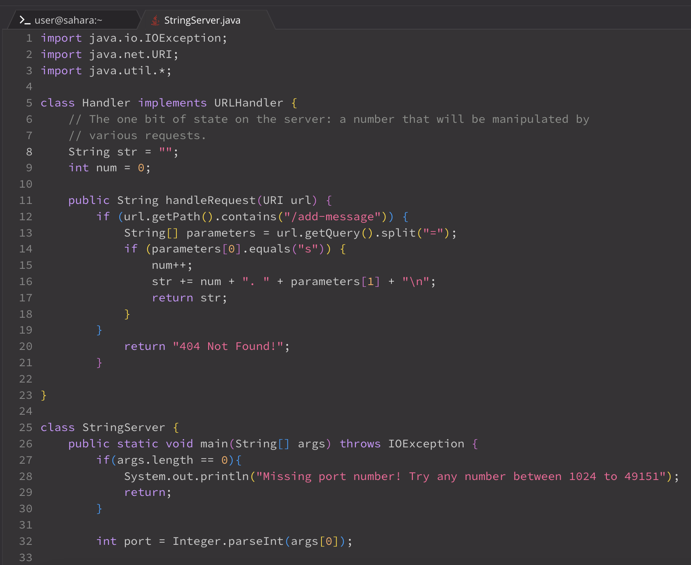
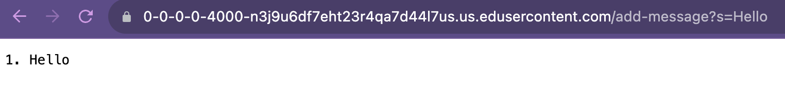
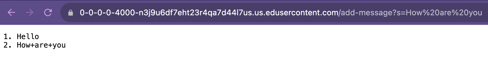

# Lab Report 2

## Part 1

Image: Code

Image: Hello

- Which methods in your code are called?
  The String handleRequest(URI url) method was called.
  
- What are the relevant arguments to those methods, and the values of any relevant fields of the class?
  The argument to the method is **4000**. The value of str is **Hello**, and the value of num is **1**.
  
- How do the values of any relevant fields of the class change from this specific request? If no values got changed, explain why.
  The value of num changed from **0** to **1**.
  The value of str changed from an empty string to **1. Hello** /n.  

Image: How are you

- Which methods in your code are called?
  The String handleRequest(URI url) method was called.
  
- What are the relevant arguments to those methods, and the values of any relevant fields of the class?
  The argument to the method is **4000**. The value of str is **How are you**, and the value of num is **2**.
  
- How do the values of any relevant fields of the class change from this specific request? If no values got changed, explain why.
  The value of num changed from **1** to **2**.
  The value of str changed from **1. Hello** to **1. Hello** /n **2. How are you ** /n

## Part 2

## Part 3
