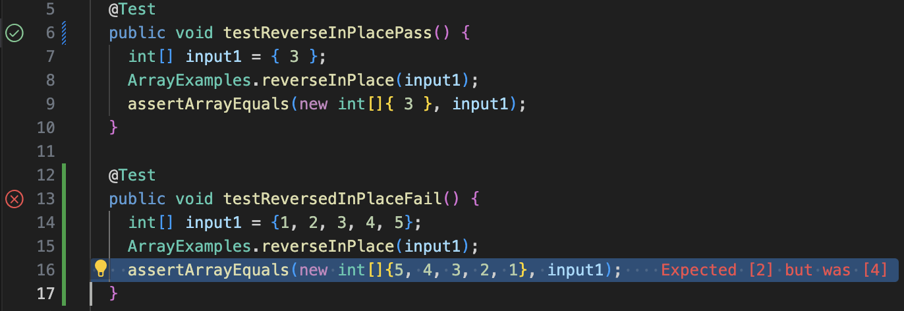

# Lab Report 2

## Part 1 - Bugs 

- A failure-inducing input for the buggy program, as a JUnit test and any associated code (write it as a code block in Markdown)

    ```
    @Test 
    public void testReversedInPlaceFail() {
        int[] input1 = {1, 2, 3, 4, 5};
        ArrayExamples.reverseInPlace(input1);
        assertArrayEquals(new int[]{5, 4, 3, 2, 1}, input1);
    }
    ```


- An input that doesn’t induce a failure, as a JUnit test and any associated code (write it as a code block in Markdown)


    ```
    @Test 
	public void testReverseInPlacePass() {
        int[] input1 = { 3 };
        ArrayExamples.reverseInPlace(input1);
        assertArrayEquals(new int[]{ 3 }, input1);
	}
    ```


- The symptom, as the output of running the tests (provide it as a screenshot of running JUnit with at least the two inputs above)

  


- The bug, as the before-and-after code change required to fix it (as two code blocks in Markdown)
    - before: 
        ```
        static void reverseInPlace(int[] arr) {
            for(int i = 0; i < arr.length; i += 1) {
            arr[i] = arr[arr.length - i - 1];
            }
        }
        ```
    - after: 
        ```
        static void reverseInPlace(int[] arr) {
            int[] temp = new int[arr.length];
            for(int i = 0; i < arr.length; i += 1) {
            temp[i] = arr[i];
            }
            for(int i = 0; i < arr.length; i += 1) {
            arr[i] = temp[arr.length - i - 1];
            }
        }
        ```

- Briefly describe why the fix addresses the issue.
    - The problem in reverseInPlace is that it changes the input array without storing the element of the array somewhere else first, leading to the loss of the original array element. The fix adds a new array `temp` to make a shallow copy of the input array, and then copy each element from the 'temp' array into the original array in reversed order. 


## Part 2 - Researching Commands 

Command: 'find'


- Option 1: -name (search for file based on their name)
    - Source: https://tecadmin.net/linux-find-command-with-examples/
    - Example 1
        ```
        aliceee@Alices-MacBook-Air-2 docsearch % find ./technical/911report -name "*.txt"
        ./technical/911report/chapter-13.4.txt
        ./technical/911report/chapter-13.5.txt
        ./technical/911report/chapter-13.1.txt
        ./technical/911report/chapter-13.2.txt
        ./technical/911report/chapter-13.3.txt
        ./technical/911report/chapter-3.txt
        ./technical/911report/chapter-2.txt
        ./technical/911report/chapter-1.txt
        ./technical/911report/chapter-5.txt
        ./technical/911report/chapter-6.txt
        ./technical/911report/chapter-7.txt
        ./technical/911report/chapter-9.txt
        ./technical/911report/chapter-8.txt
        ./technical/911report/preface.txt
        ./technical/911report/chapter-12.txt
        ./technical/911report/chapter-10.txt
        ./technical/911report/chapter-11.txt
        ```
        - This command helps us quickly find all the files end with ".txt" nested in the working directory. 

    - Example 2
        ```
        aliceee@Alices-MacBook-Air-2 docsearch % find ./technical -name "*report*"
        ./technical/government/About_LSC/Progress_report.txt
        ./technical/government/About_LSC/Strategic_report.txt
        ./technical/government/About_LSC/Special_report_to_congress.txt
        ./technical/government/About_LSC/commission_report.txt
        ./technical/government/About_LSC/reporting_system.txt
        ./technical/911report
        ```
         - This command helps us quickly find all the files that contain the word "report" nested in the working directory.


- Option 2: -type (search for file based on their type)
    - Source: https://tecadmin.net/linux-find-command-with-examples/
    - Example 1
        ```
        aliceee@Alices-MacBook-Air-2 docsearch % find ./technical -type d
        ./technical
        ./technical/government
        ./technical/government/About_LSC
        ./technical/government/Env_Prot_Agen
        ./technical/government/Alcohol_Problems
        ./technical/government/Gen_Account_Office
        ./technical/government/Post_Rate_Comm
        ./technical/government/Media
        ./technical/plos
        ./technical/biomed
        ./technical/911report
        ```
        - This command helps us quickly find all the sub-directories nested in the working directory.  
    - Example 2
        ```
        aliceee@Alices-MacBook-Air-2 docsearch % find ./technical -type l
        ```
        - This command helps us quickly find all the symbolic links nested in the working directory. In the example, nothing is returned, indicating that there isn't any symbolic link in technical.

- Option 3: -size (search for file based on their size)
    - Source: https://tecadmin.net/linux-find-command-with-examples/
    - Example 1
        ```
        aliceee@Alices-MacBook-Air-2 docsearch % find ./technical -size +60k
        ./technical/government/About_LSC/Strategic_report.txt
        ./technical/government/About_LSC/commission_report.txt
        ./technical/government/About_LSC/State_Planning_Report.txt
        ./technical/government/Env_Prot_Agen/multi102902.txt
        ./technical/government/Env_Prot_Agen/jeffordslieberm.txt
        ./technical/government/Env_Prot_Agen/ctf7-10.txt
        ./technical/government/Env_Prot_Agen/ctf1-6.txt
        ./technical/government/Env_Prot_Agen/ctm4-10.txt
        ./technical/government/Env_Prot_Agen/atx1-6.txt
        ./technical/government/Env_Prot_Agen/bill.txt
        ./technical/government/Env_Prot_Agen/tech_adden.txt
        ./technical/government/Alcohol_Problems/Session3-PDF.txt
        ./technical/government/Alcohol_Problems/Session4-PDF.txt
        ./technical/government/Gen_Account_Office/d0269g.txt
        ./technical/government/Gen_Account_Office/Testimony_cg00010t.txt
        ./technical/government/Gen_Account_Office/GovernmentAuditingStandards_yb2002ed.txt
        ./technical/government/Gen_Account_Office/Sept27-2002_d02966.txt
        ./technical/government/Gen_Account_Office/d01376g.txt
        ./technical/government/Gen_Account_Office/Statements_Feb28-1997_volume.txt
        ./technical/government/Gen_Account_Office/pe1019.txt
        ./technical/government/Gen_Account_Office/gg96118.txt
        ./technical/government/Gen_Account_Office/July11-2001_gg00172r.txt
        ./technical/government/Gen_Account_Office/d03419sp.txt
        ./technical/government/Gen_Account_Office/Sept14-2002_d011070.txt
        ./technical/government/Gen_Account_Office/d01591sp.txt
        ./technical/government/Gen_Account_Office/Oct15-2001_d0224.txt
        ./technical/government/Gen_Account_Office/im814.txt
        ./technical/government/Gen_Account_Office/ai00134.txt
        ./technical/government/Gen_Account_Office/Testimony_Jul17-2002_d02957t.txt
        ./technical/government/Gen_Account_Office/ai9868.txt
        ./technical/government/Gen_Account_Office/May1998_ai98068.txt
        ./technical/government/Gen_Account_Office/d02701.txt
        ./technical/government/Gen_Account_Office/ai2132.txt
        ./technical/government/Post_Rate_Comm/Mitchell_6-17-Mit.txt
        ./technical/biomed/gb-2003-4-5-r34.txt
        ./technical/biomed/gb-2001-2-7-research0025.txt
        ./technical/biomed/gb-2003-4-4-r26.txt
        ./technical/biomed/gb-2003-4-7-r42.txt
        ./technical/biomed/gb-2002-3-7-research0036.txt
        ./technical/biomed/gb-2003-4-7-r43.txt
        ./technical/biomed/1471-2121-3-15.txt
        ./technical/biomed/1472-6904-2-5.txt
        ./technical/biomed/gb-2002-3-11-research0059.txt
        ./technical/biomed/1472-6807-3-1.txt
        ./technical/biomed/1472-6904-3-1.txt
        ./technical/biomed/1471-2105-2-8.txt
        ./technical/biomed/gb-2002-3-12-research0086.txt
        ./technical/biomed/gb-2002-3-12-research0083.txt
        ./technical/biomed/1475-4924-1-10.txt
        ./technical/biomed/1476-511X-1-2.txt
        ./technical/biomed/1471-2105-3-18.txt
        ./technical/biomed/1471-2202-3-1.txt
        ./technical/biomed/1472-6882-1-10.txt
        ./technical/biomed/1471-2105-3-2.txt
        ./technical/biomed/1476-069X-2-9.txt
        ./technical/911report/chapter-13.4.txt
        ./technical/911report/chapter-13.5.txt
        ./technical/911report/chapter-13.1.txt
        ./technical/911report/chapter-13.2.txt
        ./technical/911report/chapter-13.3.txt
        ./technical/911report/chapter-3.txt
        ./technical/911report/chapter-2.txt
        ./technical/911report/chapter-1.txt
        ./technical/911report/chapter-5.txt
        ./technical/911report/chapter-6.txt
        ./technical/911report/chapter-7.txt
        ./technical/911report/chapter-9.txt
        ./technical/911report/chapter-8.txt
        ./technical/911report/chapter-12.txt
        ./technical/911report/chapter-11.txt
        ```
        - This command helps us quickly find all the files that is larger than a certain size (in this case 60k) nested in the working directory. 

    - Example 2
        ```
        aliceee@Alices-MacBook-Air-2 docsearch % find ./technical -size -1k 
        ./technical
        ./technical/government
        ./technical/government/About_LSC
        ./technical/government/Env_Prot_Agen
        ./technical/government/Alcohol_Problems
        ./technical/government/Post_Rate_Comm
        ./technical/plos/pmed.0020191.txt
        ./technical/plos/pmed.0020226.txt
        ./technical/911report
        ```
        - This command helps us quickly find all the files that is smaller than a certain size (in this case 1k) nested in the working directory. 

- Option 4: combining multiple search criteria using logical operators
    - Source: https://tecadmin.net/linux-find-command-with-examples/
    - Example 1
        ```
        aliceee@Alices-MacBook-Air-2 docsearch % find ./technical -name "*.txt" -and -size -1k
        ./technical/plos/pmed.0020191.txt
        ./technical/plos/pmed.0020226.txt

        ```
        - This combination of commands and logical operator helps us quickly find the files that meet two (or more) criteria nested in the working directory. In this case, it finds the files that end with ".txt" and are less than 1kb in size. 
    - Example 2
        ```
        aliceee@Alices-MacBook-Air-2 docsearch % find ./technical -not -name "*.txt"
        ./technical
        ./technical/government
        ./technical/government/About_LSC
        ./technical/government/Env_Prot_Agen
        ./technical/government/Alcohol_Problems
        ./technical/government/Gen_Account_Office
        ./technical/government/Post_Rate_Comm
        ./technical/government/Media
        ./technical/plos
        ./technical/biomed
        ./technical/911report
        ```
        - This combination of command and logical operator helps us quickly find the files whose names DO NOT end with ".txt" nested in the working directory. 


