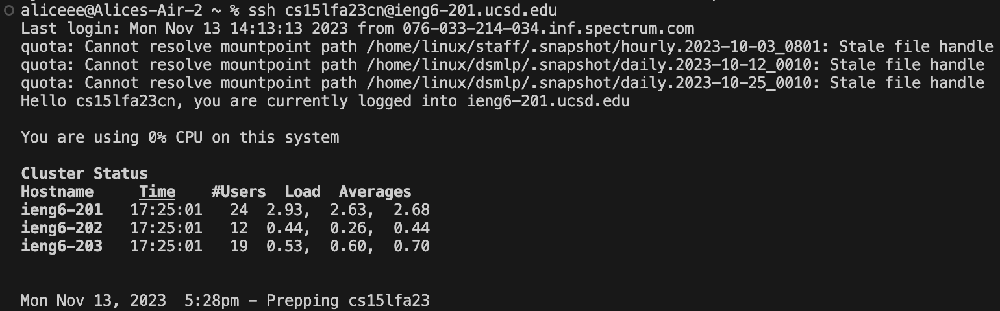
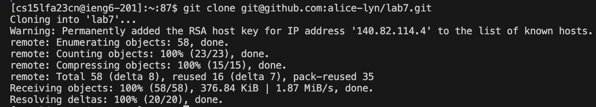
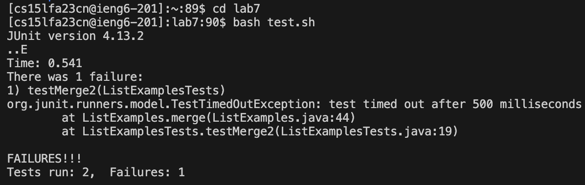
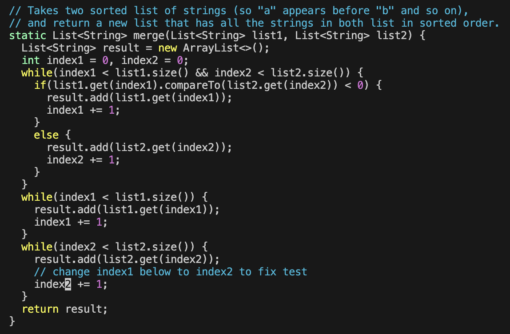
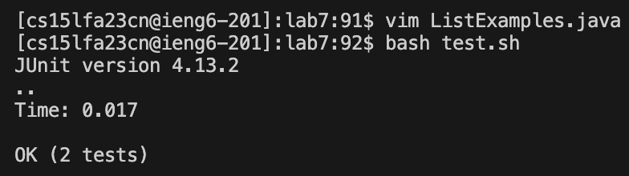
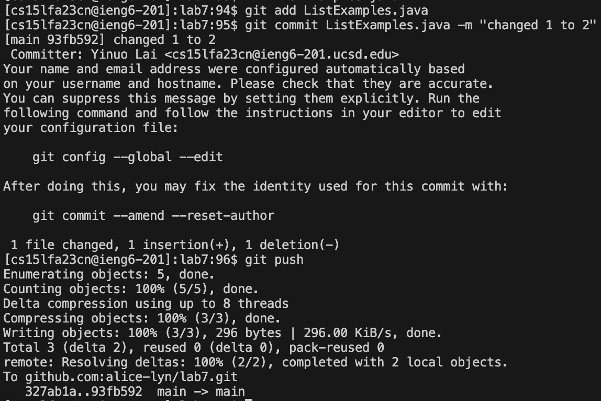

# Lab Report 4

## Step 4 - log in to ieng6

Keys pressed: `<up> <up> <enter>`

The command `ssh cs15lfa23cn@ieng6-201.ucsd.edu` was 2 up in the search history, so I used up arrow to access it. 

## Step 5 - git clone

Keys pressed: `<up> <up> <up> <up> <up> <up> <enter>`

The command `git clone git@github.com:alice-lyn/lab7.git` was 6 up in the search history, so I used up arrow to access it. 

## Step 6 - fail

Keys pressed: `cd lab7 <enter>`, `bash test.sh <enter>`

I used cd to set lab7 as the working directory, and then run bash test.sh to run the junit test. 

## Step 7 - fix code

Key pressed: vim ListExamples.java `<Enter>`, `x`, `i`, `2`, `<esc>`, `:wq <enter>`

For some reasons my cursor was exactly at where I want to edit right after I entered vim, so I didnt have to move the cursor. I directly used `x` to delete the "1", entered insert mode using `i`, typed '2', and return to normal mode using `<esc>`. I then save and quit the file using `:wq`. 

## Step 8 - pass 

Key pressed: `<up> <up> <enter>`

The command `bash test.sh` was 2 up in the search history, so I used up arrow to access it in order to run the junit test again.

## Step 9 - commit and push 

Key pressed: `git add ListExamples.java <Enter>`, `git commit ListExamples.java -m "changed 1 to 2" <Enter>`, `git push <Enter>`

I used `git add ListExamples.java` to stage the file ListExamples.java to be part of the next commit, then I used `git commit ListExamples.java -m "changed 1 to 2"` to create a commit locally for the staged file with a message. Finally, I used `git push` to copy all the new commits to github.  