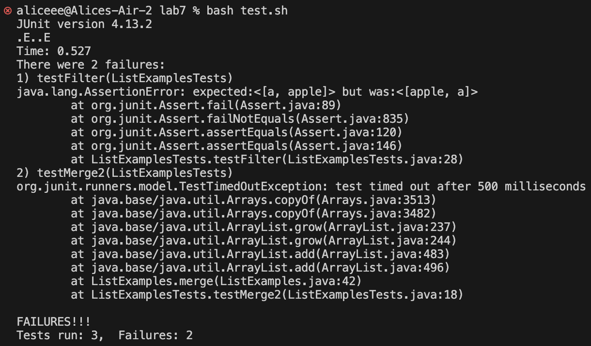
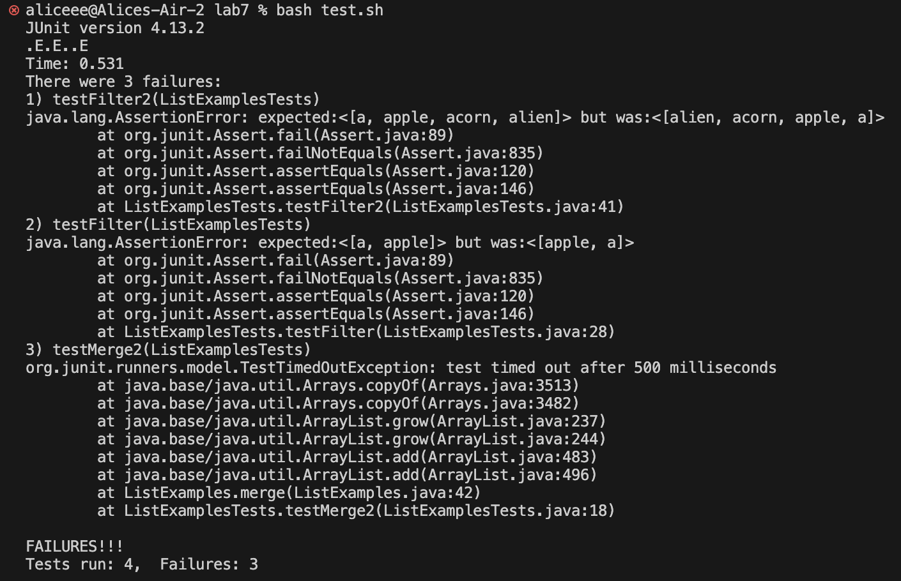
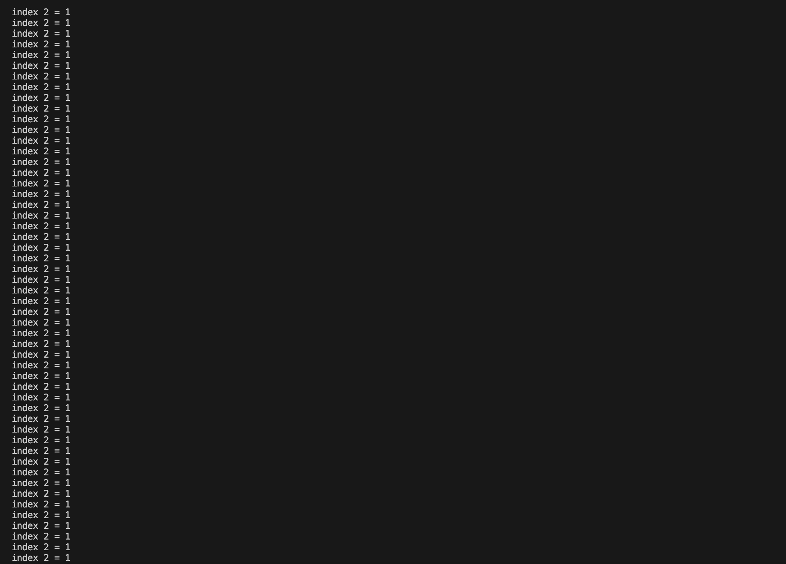
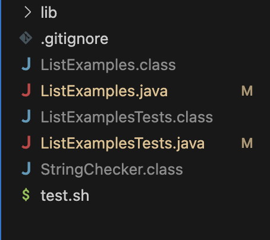

# Lab Report 5

## Part 1 – Debugging Scenario

**1. Post from student**

> 
**Student A:** According to the tests that failed, the error inducing input for the filter method is the list {"a", "b", "apple"}, which did not pass the test where the filter was supposed to filter out the strings that don't start with the letter 'a'. Although the content of the output is correct, they're not at the right posisiton. For the merge method, the error inducing input is the lists {"a", "b", "c"} and {"c", "d", "e"}. The output is supposed to be the merged list {"a", "b", "c", "c", "d", "e"} but was timed out, indicating that there might be some out of bound error or the program got stuck in an infinite loop. 


**2. Response from TA**

> **TA:** Hi Student A! Your analysis for the error-inducing input and the possible reasons for failure are on the right track! For the filter method, consider these possibilities: are the elements in the output list in reverse order, or are their indexes shifted to the left or right? I suggest you to try out lists that are longer to narrow down the problem! For the merge method, the runtime was too long, resulting in the TimedOutException. I recommand printing out the values of the variables that you think might lead to infinite loop or out-of-bound indexes. 


**3. Another output from student**

> 

**Student A:** In p1, I wrtoe another test for the filter method with a longer list and figured that the output are in reverse order. There must be something wrong with the index when new elements are being added to the output list. In p2, I added a print statement that prints out the value of index1 and index2 and figured that they cause a infinite loop, leading to the TimedOutException. 


**4. The setup** 

- The file & directory structure needed
> 

- The contents of each file before fixing the bug

```
import java.util.ArrayList;
import java.util.List;

interface StringChecker { boolean checkString(String s); }

class ListExamples {

  static List<String> filter(List<String> list, StringChecker checker) {
    List<String> result = new ArrayList<>();
    for(String s: list) {
      if(checker.checkString(s)) {
        result.add(0, s);
      }
    }
    return result;
  }


  static List<String> merge(List<String> list1, List<String> list2) {
    List<String> result = new ArrayList<>();
    int index1 = 0, index2 = 0;
    while(index1 < list1.size() && index2 < list2.size()) {
      if(list1.get(index1).compareTo(list2.get(index2)) < 0) {
        result.add(list1.get(index1));
        index1 += 1;
      }
      else {
        result.add(list2.get(index2));
        index2 += 1;
      }
    }
    while(index1 < list1.size()) {
      result.add(list1.get(index1));
      index1 += 1;
    }
    while(index2 < list2.size()) {
      result.add(list2.get(index2));
      index1 += 1;
    }
    return result;
  }
}
```

- The full command line (or lines) you ran to trigger the bug

```
aliceee@Alices-Air-2 lab7 % bash test.sh
```

the content of test.sh: 

```
javac -cp .:lib/hamcrest-core-1.3.jar:lib/junit-4.13.2.jar *.java
java -cp .:lib/hamcrest-core-1.3.jar:lib/junit-4.13.2.jar org.junit.runner.JUnitCore ListExamplesTests
```

- A description of what to edit to fix the bug
> For the filter method, delete the first argument in result.add so that the element that the filter returns true can be added to the end of the new list instead of the beginning. For the merge method, change the index1 in the second while loop to index2, so that the value of index2 gets updated properly. 


## Part 2 – Reflection
During the second half of this quarter, I learned a lot more new stuffs that I've never encounter before. The ones I like the most are vim editor and bash script. Vim is just interesting and fun to use, and I'm very impressed by how efficient bash script can be in something like itering files and running multiple commands on those files. 
